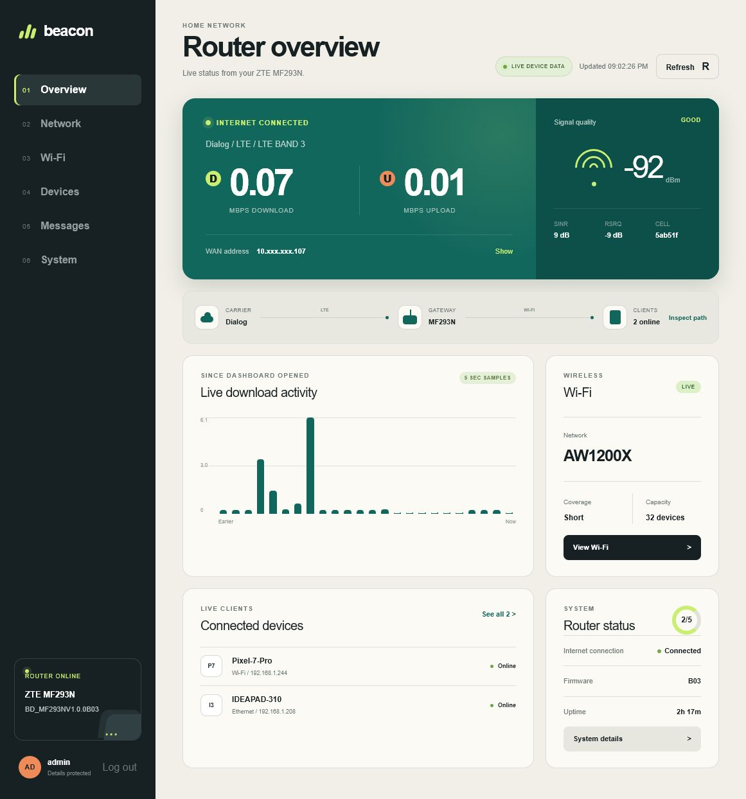
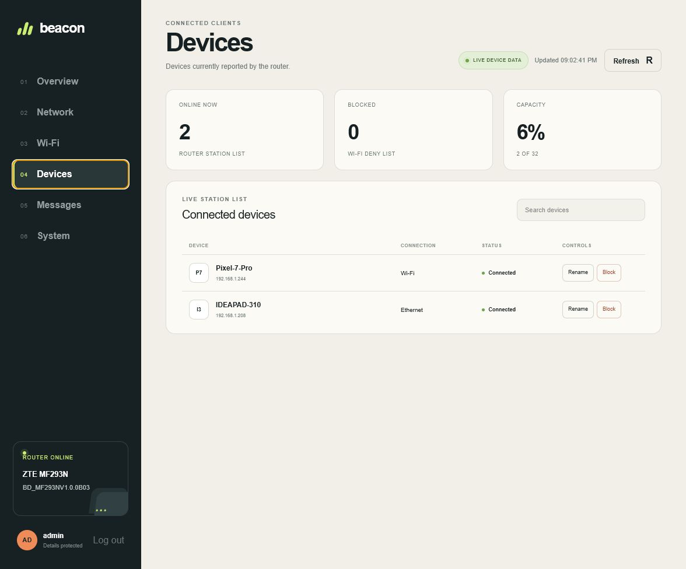

# Beacon — ZTE MF293N Router Dashboard

Beacon is a modern, SLT-free, local interface for the ZTE MF293N LTE router, developed by Nirmala. Beacon can run as a local companion app or directly from the router.

> [!IMPORTANT]
> Use Beacon only on a trusted private network. Do not expose the router admin interface, ADB, or diagnostic USB ports to the public internet.

## Features

- MF293N challenge-response login; no default password is embedded
- Live carrier, radio quality, throughput, traffic and firmware data
- Wi-Fi and Ethernet client discovery with names, IP and MAC addresses
- Wi-Fi SSID, password, coverage and client-limit settings
- Client rename, block and unblock controls
- APN editing and cellular reconnect
- Full SMS inbox, send, read and delete
- Interactive USSD send, reply and cancel
- Verified LTE band selection for bands 3, 5, 38 and 41, including combined-mask decoding and post-change verification
- Serving-cell band, EARFCN/channel, PCI, Cell ID, RSRP, RSRQ and SINR
- Per-device IPv4 upload and download speed limits using the router's traffic-control API
- Custom cellular DNS and live VPN-passthrough status
- Live upload/download speed in the page header and overview
- Four modem receive-chain readings with RSRP, SINR and signal bars
- Honest 12V power-source reporting (the board has no exposed current sensor, so watts are not invented)
- About and credits page with Nirmala's website, GitHub and Facebook links
- GitHub Releases update channel with SHA-256 verified web-and-device packages and rollback copies
- OTA check, traffic reset and normal restart
- Admin Functions section with verified UID-0 ADB status and guarded recovery controls
- Tunnel runtime audit for V2Ray, WireGuard, OpenVPN, IKEv2, PPTP and L2TP

The inspected firmware contains internal neighbor-cell telemetry code but does not expose an authenticated neighbor scan or verified PCI/EARFCN cell-lock command. Beacon reports the serving-cell identity but will not fake support or send an unknown modem command. Download and bootloader controls remain locked until the exact board-specific transitions and recovery path are verified.

The stock firmware also has no V2Ray, WireGuard, OpenVPN, IKEv2, PPTP or L2TP client executable installed. Beacon therefore reports these runtimes as unavailable instead of presenting non-working controls; client devices can still use their own VPNs through the enabled VPN passthrough.

The inspected MF293N has an ARMv7 CPU, Linux 3.4.110, approximately 54 MB RAM, about 14 MB free user flash, no `/dev/net/tun`, no WireGuard module, and no mounted external storage. Current V2Ray/Xray ARM packages are larger than the available flash and are not safe to force into this router. Beacon v0.2.0 adds runtime slots and [`tools/install-tunnel-runtime.ps1`](tools/install-tunnel-runtime.ps1) for a future tested ARMv7 binary; the installer checks architecture, storage and TUN requirements before writing anything.

## Beacon GitHub updates

Pushing a tag such as `v0.2.1` runs `.github/workflows/beacon-release.yml`. It builds Beacon and publishes:

- `beacon-router-ui.zip`
- `beacon-router-ui.zip.sha256`
- `update-beacon-from-github.ps1`

The About page checks the latest GitHub Release. Because the ZTE GoAhead server exposes no safe authenticated filesystem-update endpoint and the firmware has no HTTPS download client, installation uses the supplied ADB updater. The updater verifies SHA-256, stages both the UI and device agent, installs the tested boot hook when needed, and retains `/mnt/userdata/beacon-web.previous` plus `/mnt/userdata/beacon-tools.previous` for rollback.

## Screenshots





## Supported device

Developed and verified against ZTE MF293N hardware `MF293NHW1.0` and firmware family `BD_MF293NV1.0.0B03`. Contributions that add carefully tested adapters for other routers are welcome; see [CONTRIBUTING.md](CONTRIBUTING.md).

## Run on a computer

Requirements: Node.js 22.13 or newer, npm, a computer connected to the router, and valid router administrator credentials.

```bash
git clone https://github.com/barrylk/zte-mf293n-dashboard.git
cd zte-mf293n-dashboard
npm install
npm run dev
```

Open the displayed local URL, normally `http://localhost:3000`.

## Build the device-hosted interface

The router build uses the same React interface with a same-origin bridge to the MF293N's verified `/goform` API:

```bash
npm run build:router
```

This creates `dist-router/`, a small static bundle that requires no Node.js process on the router.

## Install on an unlocked MF293N

Connect an authorized, root-capable ADB session and run:

```powershell
powershell.exe -NoProfile -ExecutionPolicy Bypass -File .\tools\install-beacon-router-ui.ps1 -Adb "C:\path\to\platform-tools\adb.exe"
```

The installer stages Beacon in writable `/mnt/userdata/beacon-ui` and bind-mounts it over the read-only stock web root. It does not erase or overwrite the stock UI. To restore the stock UI immediately:

```powershell
powershell.exe -NoProfile -ExecutionPolicy Bypass -File .\tools\restore-stock-router-ui.ps1 -Adb "C:\path\to\platform-tools\adb.exe"
```

This conservative activation is cleared by a router reboot. After testing it, install Beacon permanently with:

```powershell
powershell.exe -NoProfile -ExecutionPolicy Bypass -File .\tools\install-beacon-router-ui.ps1 -Adb "C:\path\to\platform-tools\adb.exe" -Permanent
```

Permanent mode copies the complete stock web tree to writable userdata, overlays Beacon, retains the original directory as `/usr/zte_web/web.stock-beacon`, and installs the rollback helper before switching the web-root link. The normal restore command above handles both temporary and permanent installations.

## Security model

- The device-hosted build sends credentials only to the same router origin and retains them only in the open page's memory.
- The companion-server build stores credentials only in server memory and uses an HTTP-only, `SameSite=Strict` session cookie.
- State-changing controls require confirmation.
- Admin Functions does not enable Telnet, create a hidden account, or publish a root shell on the LAN.
- SMS, USSD, APN, Wi-Fi, band and restart actions can incur charges or interrupt connectivity.

## Project structure

```text
app/                 Shared dashboard interface and companion-server API
router-ui/           Static router entry point and same-origin API bridge
tools/               Reversible device install and rollback scripts
dist-router/         Generated device-hosted bundle
```

## Contributing

Other devices are welcome. New support must document the tested model and firmware, keep device-specific commands in an adapter, preserve confirmation guards, and never guess write commands for radio, bootloader or flash operations.

## Disclaimer

This independent community project is not affiliated with or endorsed by ZTE or any mobile carrier. Keep a full partition backup before firmware work. You are responsible for connectivity interruptions, carrier charges and compliance with local radio rules.

[GitHub project](https://github.com/barrylk/zte-mf293n-dashboard) · Beacon router interface · Developed by Nirmala
